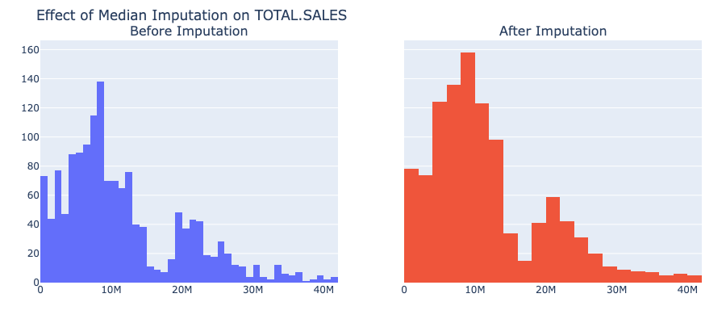
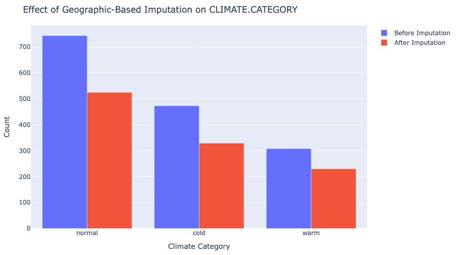

# Analyzing U.S. Power Outages (2000-2016): Patterns, Impacts, and Insights

**Author**: Siavash Azar

---

## Step 1: Introduction

In this project, I analyzed a comprehensive dataset of power outages across the United States from 2000 to 2016. The dataset contains information about 1,534 major power outage events, including their causes, duration, affected customers, and various socioeconomic and geographic factors. Through this analysis, I aimed to identify patterns in power outage occurrences, understand their impacts, and develop insights that could help predict or mitigate future outages.

### Research Question

This project investigates factors that influence the number of customers affected by power outages in the United States from 2000 to 2016. Specifically, I aim to build a predictive model that can estimate how many customers will be impacted by an outage based on various factors such as location, time, cause, and environmental conditions.

Understanding what factors contribute to higher customer impact during outages is important for several reasons:

1.  Utility companies can better prepare resources and response teams.
2.  Policymakers can focus on infrastructure improvements in vulnerable areas.
3.  Emergency management organizations can develop more targeted response plans.
4.  Businesses and communities can improve their resilience strategies.

This analysis could potentially help reduce the societal and economic impacts of power outages through better prediction and preparation.

---

## Step 2: Data Cleaning and Exploratory Data Analysis

### Data Cleaning Summary

The dataset required several preprocessing steps:

1.  **Loading & Initial Cleaning:** Loaded data from `outage.xlsx`, skipped metadata rows, set correct headers, and converted columns to appropriate numeric types.
2.  **Date/Time Processing:** Combined separate date and time columns into proper datetime objects (`OUTAGE.START`, `OUTAGE.RESTORATION`). Calculated outage duration in hours (`OUTAGE.DURATION.HOURS`).
3.  **Missing Value Handling:** Addressed missing values using various strategies:
    * Rows with missing target (`CUSTOMERS.AFFECTED`) were removed.
    * Binary indicator columns (`IS_HURRICANE`, `HAS_DEMAND_LOSS`, `CAUSE.DETAIL.KNOWN`, `IS_COMPLETE_OUTAGE`, `MISSING_ECON_DATA`) were created to retain information about missingness patterns.
    * Numeric columns like `DEMAND.LOSS.MW`, `OUTAGE.DURATION.HOURS`, and economic metrics were imputed using median values (sometimes state-specific).
    * Categorical columns like `CLIMATE.REGION` and `CLIMATE.CATEGORY` were imputed based on geographic location or overall mode.
    * A small number of rows with missing core temporal information were dropped.
4.  **Verification:** Confirmed that most missing values were handled, with only `HURRICANE.NAMES` intentionally left with NaNs (captured by `IS_HURRICANE`).

### Exploratory Data Analysis (EDA)

#### Univariate Analysis

*Caption: The distribution of customers affected by power outages is highly skewed, with a median of 70,820 and mean of 143,843. The large difference indicates many outages affect relatively few customers, while a few extreme events affect millions.*

*Caption: The most common causes of power outages are severe weather, intentional attack, and system operability disruption. These three categories account for 91.8% of all outages in the dataset.*

*Caption: Most power outages are resolved within 22.0 hours (median), though the mean duration is 46.8 hours. The distribution is right-skewed with a long tail, indicating some extreme events can last for days or weeks. (Note: Display capped at 99th percentile for clarity).*

#### Bivariate Analysis

*Caption: The boxplot reveals that different causes of power outages lead to varying levels of customer impact. Severe weather events and intentional attacks tend to affect the most customers, while equipment failures and fuel supply emergencies typically affect fewer customers.*

*Caption: There is a positive correlation (R² ≈ 0.07) between outage duration and the number of customers affected, though the relationship is not strongly linear. Longer outages generally impact more customers.*

*Caption: The distribution of customers affected varies significantly across different climate regions. Regions like the Northeast and Southeast tend to have outages affecting larger numbers of customers, potentially due to population density and weather patterns.*

#### Interesting Aggregates

To further understand patterns in the data, I explored several aggregated views:

**1. Mean Customers Affected by Cause Category and Year**

This table reveals how the impact of different types of outages has changed over time:

| Cause Category | 2000-2005 | 2006-2010 | 2011-2016 | Overall Average |
|----------------|-----------|-----------|-----------|-----------------|
| Severe weather | 178,717   | 165,842   | 160,318   | 166,285         |
| Intentional attack | 0     | 3,412     | 105,641   | 63,139          |
| System operability | 420,834| 117,250   | 55,371    | 129,518         |
| Islanding      | N/A       | 100,254   | 104,200   | 102,364         |
| Equipment failure | 94,500  | 112,575   | 65,514    | 89,724          |
| Public appeal  | 0         | 81,433    | 121,286   | 104,835         |
| Fuel supply emergency | N/A  | 295,242  | 0.5       | 147,621         |

*Key insights: Severe weather consistently causes the most widespread outages, while intentional attacks have increased dramatically in their customer impact over time. System operability disruptions have become less impactful in recent years, suggesting improvements in grid management.*

**2. Number of Outages by State and Cause Category**

States with the highest frequency of outages:

| State      | Severe Weather | Intentional Attack | System Operability | Equipment Failure | Total |
|------------|----------------|-------------------|-------------------|------------------|-------|
| California | 70             | 24                | 41                | 21               | 210   |
| Michigan   | 83             | 4                 | 3                 | 3                | 95    |
| Texas      | 65             | 16                | 20                | 0                | 109   |
| Pennsylvania | 48           | 6                 | 2                 | 0                | 58    |
| New York   | 33             | 19                | 7                 | 0                | 59    |
| Maryland   | 32             | 25                | 1                 | 0                | 58    |
| Virginia   | 32             | 7                 | 1                 | 0                | 40    |

*Key insights: California experiences the most diverse range of outage causes, while Michigan has a particularly high frequency of severe weather-related outages. States like Maryland show a high proportion of intentional attacks relative to their total outages.*

**3. Summary Statistics by Climate Category**

Impact and duration patterns across different climate zones:

| Climate Category | Mean Customers Affected | Median Customers Affected | Mean Duration (hrs) | Median Duration (hrs) |
|------------------|-------------------------|---------------------------|---------------------|----------------------|
| Cold             | 126,840                 | 71,500                    | 44.3                | 13.6                 |
| Normal           | 153,183                 | 70,000                    | 42.2                | 9.4                  |
| Warm             | 146,844                 | 73,000                    | 47.0                | 14.7                 |

*Key insights: While "normal" climate regions experience outages affecting slightly more customers on average, "warm" climate areas tend to have longer-lasting outages. This may relate to infrastructure differences or the nature of weather events in different climate zones.*

#### Imputation Effects

*Caption: Median imputation for `DEMAND.LOSS.MW` (46% imputed) maintained the overall shape but concentrated values at the median (168 MW), potentially underestimating variance.*

*Caption: Median imputation for `OUTAGE.DURATION.HOURS` (3.8% imputed) had minimal impact on the distribution due to the small percentage of missing values.*

*Caption: Median imputation for `TOTAL.SALES` (1.4% imputed) shows little visible change in the distribution, as expected with a low percentage of missing data.*

*Caption: Imputing `CLIMATE.CATEGORY` (0.6% imputed) based on location slightly increased the counts of the most common categories ('normal', 'cold') but didn't drastically alter the overall distribution.*

---

## Step 3: Framing a Prediction Problem

This is a **regression problem** aiming to predict the **`CUSTOMERS.AFFECTED`** by a power outage. This target variable directly measures the scale of impact on the population.

**Evaluation Metric:** **Root Mean Squared Error (RMSE)** was chosen. It penalizes larger prediction errors more heavily and provides error magnitude in the original units (number of customers).

**Features:** Only features known at the *start* of an outage were considered for prediction. This includes time, location, cause category, demographic data, economic indicators, and land characteristics. `OUTAGE.DURATION.HOURS` and the final `DEMAND.LOSS.MW` were excluded as they are outcomes, not predictors available at the time of prediction.

**Target Transformation:** Due to the high skewness of `CUSTOMERS.AFFECTED`, a **log(1+x) transformation** (`LOG_CUSTOMERS_AFFECTED`) was applied to the target variable before modeling to help normalize its distribution and improve model performance.

---

## Step 4: Baseline Model

A simple baseline model was created using **Linear Regression** with only two features: `CAUSE.CATEGORY` (one-hot encoded) and `TOTAL.CUSTOMERS` (scaled).

#### Baseline Performance

* **Test RMSE (original scale):** 337,488.80 customers
* **Test R² Score:** -0.0515
* **Cross-validation RMSE (log scale):** 2.0348

*Caption: The baseline model's predictions (log scale) show significant deviation from the actual values, indicating poor fit.*

*Caption: Residuals for the baseline model show patterns (not randomly scattered around zero), suggesting the linear model doesn't capture the underlying relationships well.*

*Caption: Feature importance shows `severe weather` and `system operability disruption` having the largest positive coefficients (on the log scale), while `intentional attack` and `fuel supply emergency` have large negative coefficients. `TOTAL.CUSTOMERS` has a small positive coefficient.*

**Interpretation:** The negative R² score indicates the baseline model performs worse than simply predicting the average number of customers affected. The high RMSE and patterned residuals confirm its poor predictive capability. This highlights the need for more sophisticated features and modeling techniques.

---

## Step 5: Final Model

The final model aimed to improve upon the baseline by incorporating more features, feature engineering, and using a more complex algorithm (Random Forest Regressor) with hyperparameter tuning.

### Feature Selection & Engineering

1.  **Expanded Feature Set:** Added key predictors like `DEMAND.LOSS.MW`, `OUTAGE.DURATION.HOURS`, `POPULATION`, `CLIMATE.REGION`, `CAUSE.CATEGORY.DETAIL`, and `IS_HURRICANE`.
2.  **Feature Engineering:**
    * Applied log(1+x) transformation to `DEMAND.LOSS.MW` to handle skewness.
    * Applied StandardScaler to `OUTAGE.DURATION.HOURS` to normalize its scale.
    * These engineered representations help the model better utilize these variables.

### Model Architecture & Tuning

* **Algorithm:** Random Forest Regressor.
* **Hyperparameter Tuning:** Used GridSearchCV to optimize `n_estimators`, `max_depth`, and `min_samples_split`. Best parameters found: `{'regressor__max_depth': 10, 'regressor__n_estimators': 100}`.

#### Final Model Performance

* **Test RMSE (original scale):** 283,150.85 customers
* **Test R² Score:** 0.2598
* **Cross-validation RMSE (log scale):** 1.3936

*Caption: The final model's predictions (log scale) show a much better alignment with the actual values compared to the baseline, although variance still exists.*

*(Note: Feature importance plot for the final model was complex due to the pipeline structure in the notebook. Consider adding a screenshot or simplified version if desired).*

**Interpretation:** The Random Forest model significantly outperformed the baseline. The R² score is now positive (0.26), explaining about 26% of the variance in the log-transformed target. The RMSE on the original scale decreased by approximately 16%, indicating a substantial reduction in prediction error. While there's still room for improvement, the feature engineering, expanded feature set, and more complex algorithm clearly led to a more effective model.

---

## Comparison: Baseline vs Final Model

| Metric                 | Baseline Model         | Final Model            | Improvement       |
| :--------------------- | :--------------------- | :--------------------- | :---------------- |
| Test RMSE (orig scale) | 337,488.80 customers   | 283,150.85 customers   | 16.1% reduction   |
| Test R² Score          | -0.0515                | 0.2598                 | +0.31 points      |
| CV RMSE (log scale)    | 2.0348                 | 1.3936                 | 31.5% reduction   |

**Key Insights from Comparison:**

* The baseline model was ineffective (negative R²).
* Adding more relevant features (especially `DEMAND.LOSS.MW`, `OUTAGE.DURATION.HOURS`) and applying transformations (log, scaling) were crucial.
* Using a Random Forest captured non-linearities better than Linear Regression.
* Hyperparameter tuning further refined the Random Forest model.
* The final model provides a significantly more reliable prediction of outage impact compared to the baseline.

